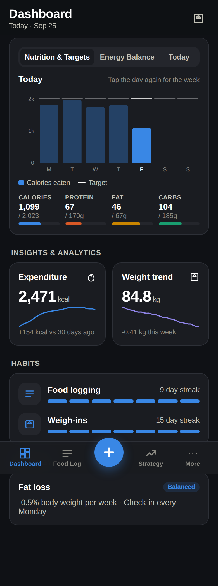
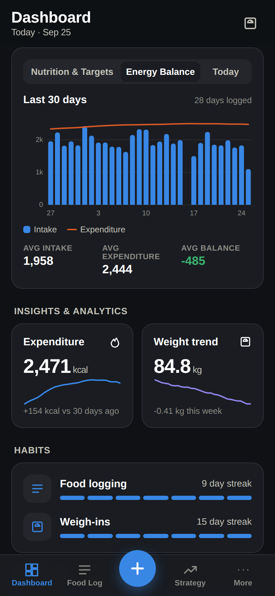
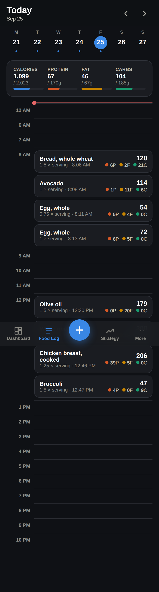
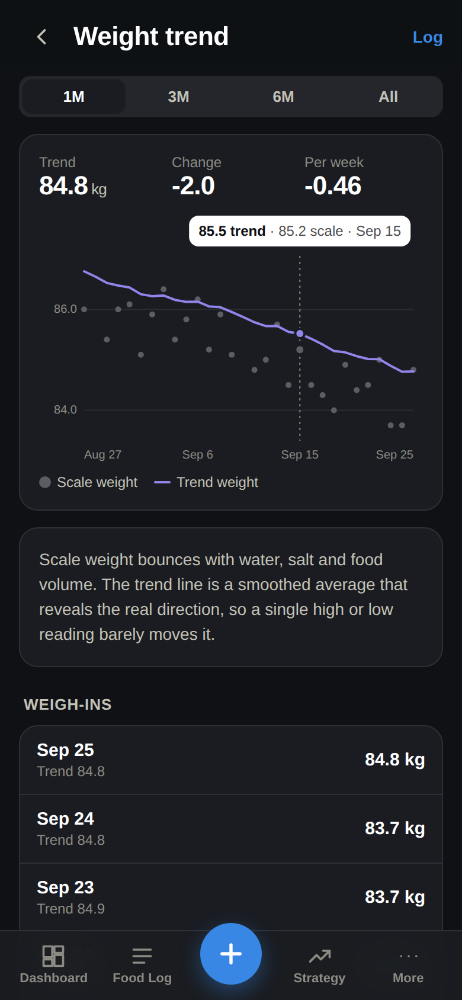
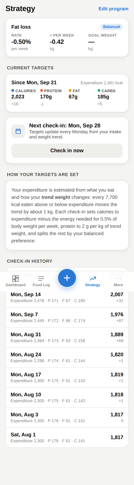
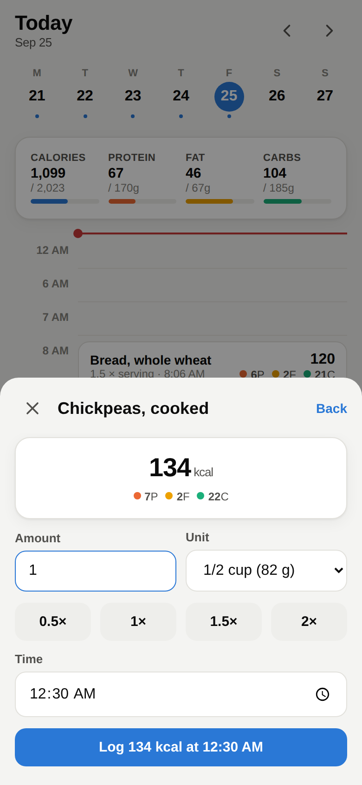

# Fuelwise

A mobile-first macro tracker and adaptive diet coach, modeled on how [MacroFactor](https://macrofactorapp.com) works: a timeline food log, a smoothed weight trend, an expenditure estimate that learns from your own data, and weekly check-ins that adjust your targets.

It's an independent project with its own name and look. It isn't affiliated with MacroFactor and uses none of its assets.

| Dashboard | Energy balance | Food log |
|---|---|---|
|  |  |  |
| **Weight trend** | **Strategy** | **Logging a food** |
|  |  |  |

## Features

- **Dashboard** has three widgets:
  - *Nutrition & Targets*: this week's intake against targets. Tap a day for its details, or tap it again to see the whole week.
  - *Energy Balance*: intake against expenditure over the last 30 days.
  - *Today*: a calorie ring plus progress for each macro.
- The Dashboard also has expenditure and weight-trend cards, streaks for logging and weighing in, and a summary of your strategy.
- **Food log** is a timeline rather than meal buckets. It has a week strip, macro totals, and a red "now" line. Tap an hour to log food at that time, or tap an entry to change its servings or time, log it again, or delete it. You can copy the previous day.
- **Logging food** works by searching the built-in foods (about 80 common ones) plus your own, with recent foods shown first. You can enter servings or grams, and there's also quick add by macros and a form for creating custom foods.
- **Weight trend** plots scale weigh-ins as dots under a smoothed trend line, with 1M, 3M, 6M and All ranges, and lists every weigh-in.
- **Expenditure** shows the adaptive TDEE estimate over time.
- **Strategy** covers:
  - Goal: lose, maintain or gain, with a rate as a % of body weight per week and an optional goal weight with an estimated date.
  - Diet style: balanced, low fat, low carb or keto, with protein set in g/kg.
  - The check-in day, a "check in now" button, and the history of past check-ins.
- **Onboarding** gives a starting estimate from Mifflin–St Jeor, or Katch–McArdle if you enter a body-fat %. You can also explore with demo data.
- **More** has units (kg or lb), theme (system, light or dark), week start, your profile, and your custom foods. It also has JSON export and import, a demo-data loader, and reset.

**Accounts and sync:** sign in with an email and password and your data syncs to Supabase, so it's on every device you use. You can also choose "Use without an account", which keeps everything in this browser's `localStorage` only.

## How the coaching works (`src/lib/nutrition.ts`)

- **Trend weight** is an exponentially weighted moving average (α = 0.1) of scale weight. Days without a weigh-in are filled by straight-line interpolation between the weigh-ins around them.
- **Expenditure**: each day, the app looks back over the last 21 days. The raw estimate is average intake minus the trend-weight change × 7700 kcal/kg ÷ days.
  - The raw estimate is blended into the running estimate, weighted by how much of the window was logged.
  - Unlogged days are skipped, not counted as zero.
  - It needs at least 7 logged days before it moves off the starting estimate.
- **Targets**:
  - Calories are expenditure plus the energy needed for the goal rate. They never go below 1200.
  - Protein is g/kg × trend weight.
  - Fat is a share of calories that depends on the diet style; carbs make up the rest. Keto fixes carbs at 30 g.
- **Check-ins** happen weekly on your chosen day and record new targets from that day onward.

## Hosting

- **App:** Vercel project `fuelwise`, live at https://fuelwise-pink.vercel.app. Every push to the production branch redeploys it.
- **Data:** Supabase project `fuelwise` (`zuijnrtzxhbfzvlrgmxj`). Its tables are `profiles`, `foods`, `log_entries`, `weights` and `targets_history`. Row-level security limits every row to the user who owns it.
- **Environment variables:** `VITE_SUPABASE_URL` and `VITE_SUPABASE_PUBLISHABLE_KEY` are set in Vercel; see `.env.example`. The publishable key is designed to be used in the browser. If they're left unset, the app runs local-only.

How sync works (`src/lib/sync.ts`): the app keeps using its local store for everything on screen. Shortly after each change, it compares the store with the last copy it saved to Supabase and writes or deletes only the rows that changed. If a save fails, it retries. The first time you sign in, anything already on the device is uploaded. Signing in again later loads your account's data. The app reloads from the server when you switch back to its tab, and signing out clears the device.

## Development

```bash
npm install
cp .env.example .env.local   # optional: fill in Supabase values to enable sign-in
npm run dev        # http://localhost:5173
npm test           # algorithm unit tests (vitest)
npm run build      # typecheck + production build
```

Built with React 19, TypeScript and Vite. There's no UI library, and the charts are hand-rolled SVG.
